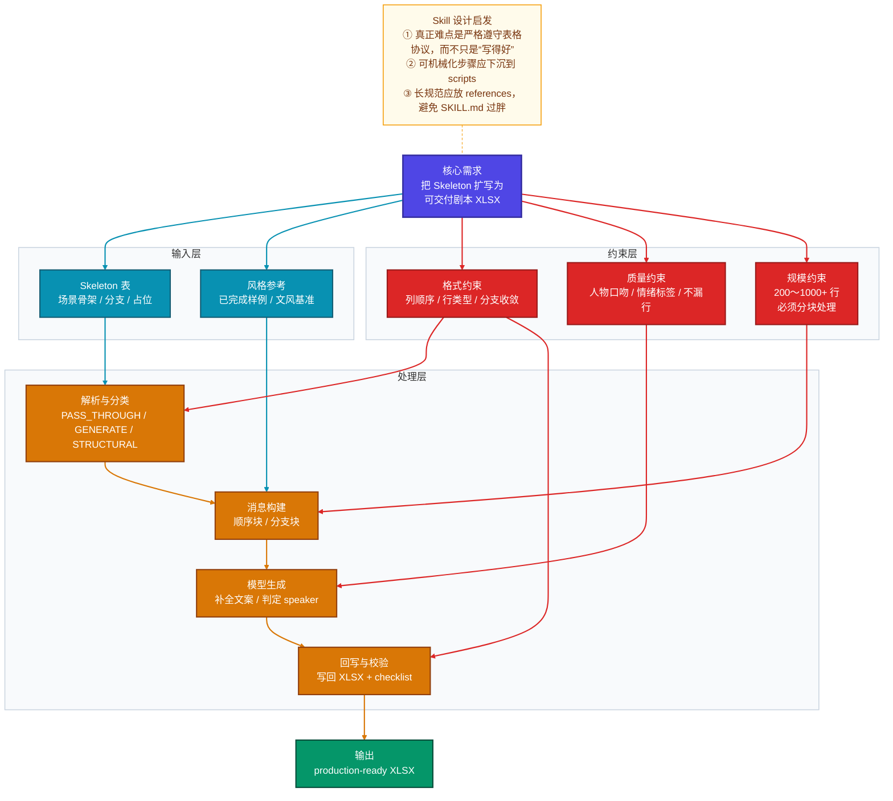
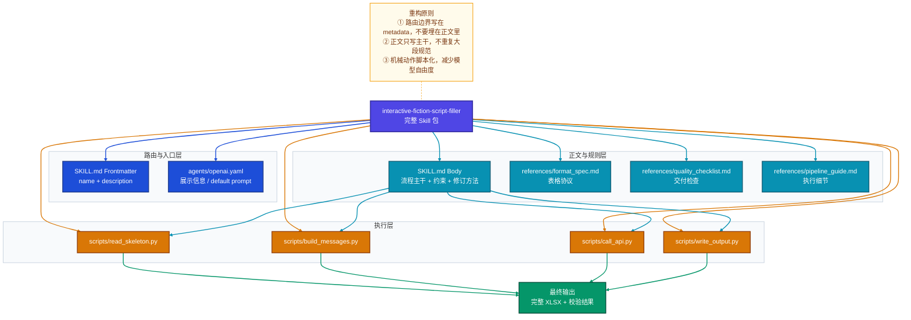
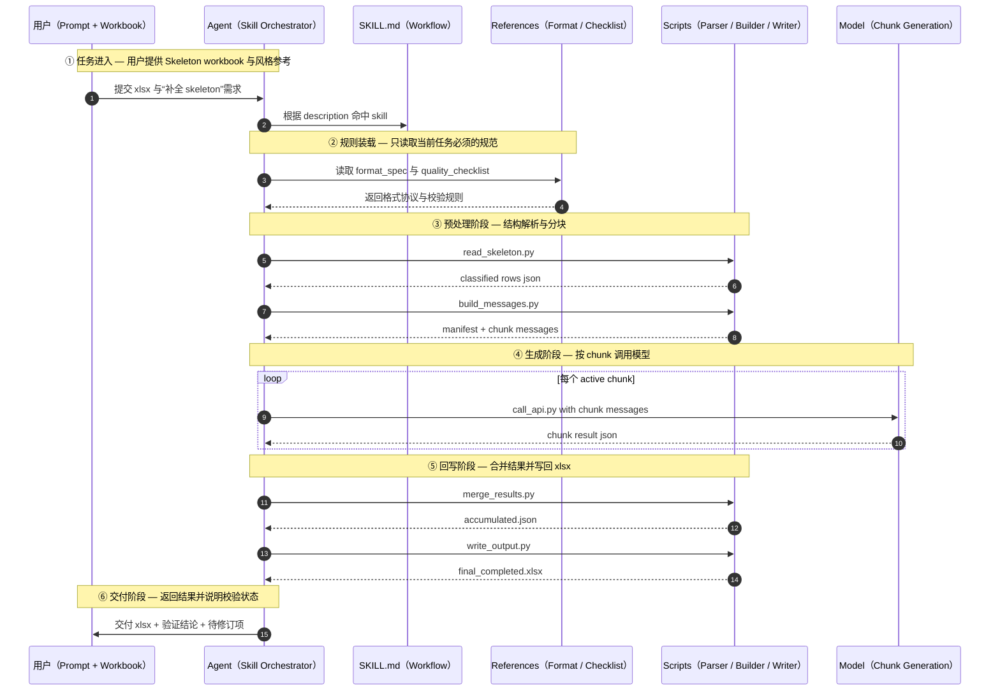

# chapters-writing-skills 示例拆解：从需求到完整 Skill 设计

> 目标：以 `chapters-writing-skills/skills/interactive-fiction-writer/` 为样例，先理解它解决的真实问题，再评估它的优点与风险，最后倒推出一版更适合学习和复用的完整 skill 设计。
>
> Mermaid 作图风格参考：
> - 系统认知层：`mermaid-A-系统认知层.md`
> - 运行时行为层：`mermaid-C-运行时行为层.md`

---

## 1. 先别急着看格式，先看它到底在解决什么问题

这个 skill 的表面任务是“写互动小说剧本”，但它真正解决的其实不是“文学创作”，而是一个更具体、更工程化的问题：

**把一个带分支结构的 Skeleton Excel 表，稳定扩写成可直接交付给游戏引擎使用的完整剧本 XLSX。**

这类需求有 4 个典型特征：

| 维度 | 具体表现 |
|------|---------|
| 输入稳定 | 用户会给你 skeleton 表、风格参考、占位内容、分支结构 |
| 输出稳定 | 必须回写为固定列顺序、固定行语义的 `.xlsx` |
| 约束很硬 | 不能乱列、不能漏 branch slot、不能改 PASS_THROUGH |
| 流程重复 | 每次都要经历“解析 → 分块 → 生成 → 回写 → 校验” |

这就是非常典型的 **skill 场景**：

- 不是纯 prompt 能稳定做好的事；
- 也不是单个脚本就能完全搞定的事；
- 而是“模型判断 + 脚本执行 + 参考规范”协同完成的事。

---

## 2. 用 Mermaid 看清这个需求的核心结构



看完这张图，可以把原始需求压缩成一句话：

> 这是一个“**格式驱动的内容生成流水线**”，而不是一个“随便写小说”的开放型创作任务。

这句话很关键，因为它会直接决定 skill 的设计方式。

---

## 3. 对原始 skill 的核心需求拆解

如果我们把 `interactive-fiction-writer` 这个样例 skill 拆开，它的核心需求可以分成 5 层。

### 3.1 业务目标

- 输入：一个未填满的 skeleton 剧本表。
- 输出：一个保持原结构、但内容已补全的完整剧本表。
- 目标：让游戏引擎按原有 row-by-row 格式直接消费。

### 3.2 输入契约

这个 skill 依赖的不是一句自然语言，而是一组结构化输入：

- `Skeleton` 工作表；
- 固定 6 列；
- choice block / branch slot / narration / callback 等约定；
- 风格参考样本；
- 人物口吻与上下文说明。

### 3.3 非功能约束

这是这个 skill 最值得学习的地方。它不是只追求“生成内容”，而是同时追求：

- **格式稳定性**：不能改列顺序，不能乱改结构行。
- **规模可处理性**：200 到 1000+ 行，必须分块。
- **可回溯性**：每一步都要有中间产物，支持重试和局部修订。
- **可验证性**：交付前必须校验缺行、情绪标签、Narration 连续性等问题。

### 3.4 哪些步骤适合模型，哪些不适合

| 步骤 | 更适合谁做 |
|------|-----------|
| 识别 Excel、分类行、回写文件 | `scripts/` |
| 判断 speaker、补全文案、贴合风格 | 模型 |
| 长规则、格式说明、检查清单 | `references/` |
| 任务入口、边界、总流程 | `SKILL.md` |

### 3.5 为什么它值得做成 skill，而不是一次性 prompt

因为它不是单轮问答，而是一个可复用的“半自动流水线”：

1. 先读结构化文件；
2. 再按规则拆分；
3. 再生成内容；
4. 再写回文件；
5. 最后验证输出。

这就是 skill 最擅长承载的任务形态。

---

## 4. 对现有示例 skill 的评估

这一步不要只看“像不像 skill”，而要看它是否真的做到了“边界清楚、实现一致、长期可维护”。

### 4.1 值得学习的地方

**一、`description` 写得很像路由规则，而不只是介绍文案。**

- 它说明了输入形态；
- 说明了典型触发词；
- 说明了适用规模。

这会直接提高隐式匹配质量。

**二、`SKILL.md` 没有试图承载所有细节，而是把细节下沉到了 `scripts/` 和 `references/`。**

这是很好的渐进披露思路：

- 元数据负责“何时触发”；
- `SKILL.md` 负责“整体怎么做”；
- `references/` 负责“细节依据是什么”；
- `scripts/` 负责“机械动作怎么执行”。

**三、它已经具备“完整工作流包”的形状。**

不是只有一个说明文件，而是：

- 有解析脚本；
- 有 prompt 构建脚本；
- 有 API 调用脚本；
- 有回写脚本；
- 有质量检查单；
- 有模板文件。

这一点很适合拿来做教学样例。

### 4.2 暴露出的 3 个典型风险

这三个点尤其值得你以后写 skill 时警惕。

#### 风险 1：文档与真实文件名漂移

原 skill 在 `SKILL.md` 和 `pipeline_guide.md` 中都提到了 `templates/system_prompt_template.md`，但实际目录里存在的是：

- `templates/system_prompt_variant_a.md`
- `templates/system_prompt_variant_b.md`

这类问题的本质不是“小笔误”，而是 **skill 文档与实现不同步**。一旦 skill 演进，最先出问题的往往不是代码，而是路由说明和流程说明。

#### 风险 2：文档写的是“两阶段 / continuity tracking”，实现却更接近“独立 chunk”

原文档里多次强调：

- “separate passes”
- “Pass 1 / Pass 2”
- “continuity tracking”

但从 `build_messages.py` 看，当前实现更偏向：

- 把顺序段和分支段分成不同 chunk；
- 每个 chunk 自成上下文；
- 明确写了 `no cross-chunk continuity dependency`；
- 分支块里还会把 direction rows 和 branch slots 合并在同一条 branch prompt 中处理。

这说明它的 **文档概念模型** 与 **代码执行模型** 已经出现偏移。

#### 风险 3：校验规则和真实格式协议没有完全对齐

`write_skeleton.py` 中有一条校验：

```python
if col_a == "Branch slot" and not col_d:
    warnings.append(...)
```

但在真实格式规范里，branch slot 并不是字面量 `Branch slot`，而是：

- `Choice N`
- `Premium Choice N`
- `Sub Choice N`
- 且 `col_B` 为空、`speaker/content` 为空

也就是说，这条校验规则并不能真正覆盖真实 branch slot 漏 speaker 的风险。

### 4.3 这给我们的启发

这个示例 skill 很值得学，但不能“照着抄”。正确的学习方式是：

- 学它的 **结构分层**；
- 学它的 **流程意识**；
- 学它的 **脚本与模型分工**；
- 同时学会识别 **文档-实现漂移**。

---

## 5. 把这个需求重新抽象成一版更清晰的 Skill

下面我们不直接复刻原 skill，而是用同一个需求，重新设计一版更适合你学习和扩展的 skill。

### 5.1 先定义 skill 边界

一个 skill 写得清不清楚，先看“它做什么”和“它不做什么”。

| 项目 | 应该写进 skill 的内容 |
|------|---------------------|
| 解决的问题 | 从 skeleton xlsx 扩写完整互动剧本 |
| 适用场景 | 有固定列格式、choice block、branch slot、风格参考 |
| 不适用场景 | 纯自由创作、没有结构化表格、只有文案润色 |
| 固定流程 | 解析、分类、分块、生成、回写、校验、修订 |
| 验收标准 | 结构不破坏、生成行不遗漏、风格接近参考、输出可交付 |

### 5.2 再决定每一层放什么

| 层 | 放什么 | 为什么 |
|----|-------|-------|
| `name + description` | 路由边界、触发词、输入特征、禁用条件 | 这是隐式触发的核心 |
| `SKILL.md` | 工作流主干、非协商约束、脚本入口、修订方式 | 这是技能正文 |
| `references/` | 格式规范、质量检查、chunk 规则、风格要求 | 细节长文按需加载 |
| `scripts/` | 读表、分类、构建消息、回写文件、校验 | 机械步骤交给代码 |
| `templates/` | prompt 变体、风格模板 | 变化多、但不应挤进正文 |
| `agents/openai.yaml` | 展示名、简短描述、默认入口提示 | 面向 UI 与调用入口 |

这一步非常重要。很多新手写 skill 时最常见的问题，是把所有东西都塞进 `SKILL.md`，最后变成一个巨大 prompt。

---

## 6. 用 Mermaid 看“重构后的 skill 设计”



---

## 7. 这版完整 Skill 的建议目录

下面这版目录，不是“唯一正确答案”，但已经是一个足够完整、结构清晰、适合团队维护的版本。

```text
.agents/
  skills/
    interactive-fiction-script-filler/
      SKILL.md
      agents/
        openai.yaml
      references/
        format_spec.md
        quality_checklist.md
        pipeline_guide.md
        style_guide.md
      scripts/
        read_skeleton.py
        build_messages.py
        call_api.py
        merge_results.py
        write_output.py
      templates/
        system_prompt_variant_a.md
        system_prompt_variant_b.md
```

### 为什么比原例子多一个 `merge_results.py`

原样例把 merge 逻辑写成 one-liner Python。教学上能看懂，但长期维护不够理想。  
如果这是你自己的 skill，我会建议把 merge 也正式收敛到脚本里，这样：

- 流程更闭环；
- 文档和实现更一致；
- 出错点更少；
- 修订时更容易定位。

---

## 8. 这版完整 Skill 的 `SKILL.md`

下面给你一版可以直接当“学习模板”的正文写法。重点不是字句，而是结构。

```md
---
name: interactive-fiction-script-filler
description: >
  Expand a structured skeleton workbook for interactive fiction or visual novel production into a
  completed xlsx while preserving the engine's exact row-by-row format. Use this skill when the user
  provides a workbook with a Skeleton tab, choice blocks, branch content slots, placeholder dialogue,
  or style-reference rows and wants a production-ready script. Do not use this skill for freeform
  story writing, loose brainstorming, or docs-only editing.
---

# Interactive Fiction Script Filler

You are filling a structured interactive-fiction skeleton into a delivery-ready xlsx.
Your job is not only to write good lines, but to preserve the workbook protocol exactly.

## Use this skill when

- The input is a workbook or row-based script skeleton.
- Choice branches and branch content slots must be preserved.
- The final output must remain compatible with an existing game-engine format.
- The user expects a completed xlsx rather than plain prose.

## Do not use this skill when

- The task is freeform plot ideation.
- The task is only line editing on a plain text script.
- There is no structured worksheet or row protocol to preserve.

## Non-negotiable rules

1. Preserve column order and row order exactly.
2. Preserve PASS_THROUGH rows bit-for-bit unless the user explicitly asks for edits.
3. Preserve STRUCTURAL rows exactly.
4. For direction rows, generate `content` and `emotion` only.
5. For branch content slots, generate `speaker`, `content`, and `emotion`.
6. Never drop, merge, or invent rows.
7. Do not skip NSFW rows unless the user explicitly requests filtering.

## Workflow

1. Validate the workbook shape and required tab.
2. Run `scripts/read_skeleton.py` to classify rows.
3. Create run context with character voice summaries and special notes.
4. Run `scripts/build_messages.py` to create chunk prompts.
5. Call `scripts/call_api.py` for each active chunk.
6. Run `scripts/merge_results.py` to combine chunk outputs.
7. Run `scripts/write_output.py` to write the final workbook.
8. Validate the result against `references/quality_checklist.md`.
9. If the user requests revisions, re-run only the impacted chunk and rebuild the final workbook.

## Read these references when needed

- `references/format_spec.md` for row and column protocol
- `references/pipeline_guide.md` for orchestration details
- `references/quality_checklist.md` for delivery checks
- `references/style_guide.md` for tone and output style

## Script contract

- `scripts/read_skeleton.py`: workbook -> classified rows json
- `scripts/build_messages.py`: rows + context -> chunk messages
- `scripts/call_api.py`: messages -> model output json
- `scripts/merge_results.py`: chunk outputs -> accumulated json
- `scripts/write_output.py`: workbook + accumulated json -> final xlsx

## Delivery expectations

- Report whether formatting integrity was preserved.
- Report whether all GENERATE rows were filled.
- Report any rows or chunks that were retried or remain uncertain.
```

这版 `SKILL.md` 跟原示例相比，有 3 个刻意优化：

1. **先写边界，再写步骤。**  
   这样路由会更稳。

2. **把“不可协商规则”独立出来。**  
   这样模型更容易抓住重点。

3. **把脚本职责写成 contract，而不是把实现细节全部塞进正文。**  
   这样正文不会过胖。

---

## 9. 这版完整 Skill 的 `agents/openai.yaml`

这个文件是可选的，但如果你希望 skill 更适合在 UI 或 skill 列表里展示，建议补上。

```yaml
display_name: Interactive Fiction Script Filler
short_description: Expand a structured skeleton workbook into a production-ready visual novel script.
default_prompt: Fill the provided skeleton workbook into a complete xlsx while preserving the exact row-by-row format.
```

这里你可以把它理解成“面向界面的包装层”，而不是 skill 核心逻辑本身。

---

## 10. 运行时流程怎么表达，最适合用时序图



这张图对应的是 skill 的“运行时行为”，它帮助你分清：

- 哪些是路由阶段；
- 哪些是参考资料装载；
- 哪些是脚本执行；
- 哪些是模型真正生成内容的地方。

---

## 11. 如果你拿到一个新需求，应该怎么照这个例子去构建 skill

以后你拿到新需求，不要先问“我要不要写 `SKILL.md`”，而是先问下面这 6 个问题。

### 11.1 第一步：这个需求是不是 skill 型需求

满足越多，越值得写成 skill：

- 会重复出现；
- 输入输出比较稳定；
- 有明显工作流；
- 有一些固定约束；
- 需要模型判断，但也需要脚本配合；
- 需要沉淀为团队共识。

### 11.2 第二步：先抽象“任务协议”

任何 skill 在落文件之前，先写出下面 4 行：

```text
输入是什么？
输出是什么？
哪些东西绝对不能改？
什么情况下不应该触发这个 skill？
```

如果这 4 行写不清楚，先不要开始写 skill。

### 11.3 第三步：给任务分层

把需求拆成这 4 层：

1. 路由层：什么时候触发、什么时候别触发。
2. 工作流层：总体步骤是什么。
3. 规则层：格式、约束、验收标准是什么。
4. 执行层：哪些动作适合脚本，哪些交给模型。

### 11.4 第四步：先做 instruction-only 版

第一次不要急着写一堆脚本。  
优先写：

- `name`
- `description`
- `SKILL.md`

只有当你发现：

- 某些操作每次都一模一样；
- 模型老是做错；
- 手工执行又很繁琐；

再把它下沉到 `scripts/`。

### 11.5 第五步：先做“最小可验证闭环”

一个 skill 真正可用，不是因为文件多，而是因为它能闭环：

```text
能触发 → 能执行 → 能验证 → 能修订
```

如果只做到“能触发”，它只是 prompt。  
如果只做到“能执行”，它只是脚本。  
**只有能闭环，才算 skill。**

### 11.6 第六步：始终检查“文档和实现是否漂移”

你可以把这个检查清单贴在桌面上：

- `SKILL.md` 里写的文件名真的存在吗？
- `references/` 里的流程，和当前脚本行为一致吗？
- 质量检查项，真的覆盖了真实格式协议吗？
- 元数据里的 `description`，还能准确描述现在的能力边界吗？

这一步就是从“会写 skill”走向“会维护 skill”。

---

## 12. 最后，把这个示例压缩成一句可复用的方法论

当你看到一个复杂需求时，不要急着问：

> “我该怎么写一个 skill 文件？”

而应该先问：

> “这个需求里，哪些是稳定协议，哪些是可复用流程，哪些是机械动作，哪些才是真正需要模型判断的部分？”

只要这个问题回答清楚了，skill 的结构通常会自然长出来：

- 稳定协议 → `references/`
- 可复用流程 → `SKILL.md`
- 机械动作 → `scripts/`
- 路由边界 → `name + description`
- 展示与入口 → `agents/openai.yaml`

这就是从“会用 skill”走向“会设计 skill”的分水岭。
