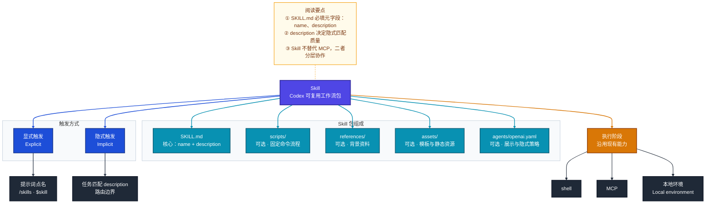
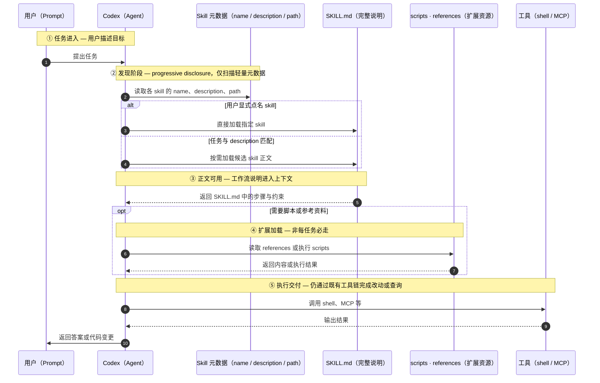

# Codex Skills 入门版

面向 Cursor / Codex 初学者。

## 先记住一句话

**Codex Skills** 是把一类任务的做法整理成「可复用工作流包」的机制：包里可以有说明、参考资料和可选脚本，让 Codex 在遇到相似任务时，更稳定地按同一套路完成工作。它适合**会反复出现、步骤相对固定、又不只是机械执行**的任务。官方把 skill 定义为 reusable workflows 的创作格式，可用于 Codex CLI、IDE 扩展与 Codex App。

---

## 1. 初学者怎么理解它

把 Codex 想成一个会写代码的助手时，可以这样类比：

| 概念 | 类比 |
|------|------|
| 普通提示词 | 临时口头交代一次任务 |
| **Skill** | 写好的「标准作业说明书」 |
| **scripts/** | 说明书里附带的小工具 |
| **references/** | 说明书引用的背景资料 |
| **Plugin** | 把上述内容打包好，方便他人安装 |

对初学者最重要的一点：**Skill 不是新模型，也不是新工具，而是让模型稳定复用经验的一种方法。** 真正执行任务时，Codex 仍依赖既有能力，例如 shell、本地环境，以及通过 MCP 接入的外部工具。

---

## 2. 为什么要有 Skills

没有 skill 时，我们常会反复写类似说明：

- 「先看改了哪些文件，再跑测试，再按固定格式总结。」
- 「做发布检查时，先比 tag，再看 changelog，再跑验证脚本。」
- 「分析 CSV 时，先清洗，再汇总，再生成 Markdown 报告。」

若每次都把整段写进 prompt，既浪费上下文，行为也不稳定。官方把 skill 设计成「说明 + 资源 + 脚本」的小包，是为了让重复流程**沉淀下来**，同时通过**渐进披露**避免一上来把所有细节塞进上下文。

---

## 3. 核心概念

下图概括初学者最该掌握的概念关系。建议阅读顺序：先看 **Skill 由什么组成**，再看 **如何被触发**，最后看 **与既有工具如何分工**。

> Mermaid 作图风格参考 `mermaid作图规范/mermaid-A-系统认知层.md`（架构/概念分层：`flowchart TB`、`classDef`、`subgraph`、`linkStyle`）。



**要点速览**

- **SKILL.md** 是核心文件，必须包含 `name` 与 `description`。
- **scripts/**、**references/**、**assets/** 均为可选，分别承载机械步骤、补充文档与模板资源。
- **agents/openai.yaml** 为可选元数据，可配置展示信息、隐式调用策略与依赖工具声明。

**关键词记忆**

- `SKILL.md`：主说明书。
- `description`：决定「什么时候该用、什么时候别用」。
- `scripts/`：固定、可脚本化的命令流程。
- `references/`：长文或规范，按需加载。
- **MCP**：不是 skill 本体，而是执行时可能依赖的外部能力接入。

---

## 4. 工作原理

下图表示 skill 从「被看见」到「参与任务」的过程。请抓住两点：**Codex 不会一上来读全库 skill 正文**；**`description` 在筛选 skill 时起决定作用**。

> Mermaid 作图风格参考 `mermaid作图规范/mermaid-C-运行时行为层.md`（时序图：`autonumber`、`participant ID as 中文（技术）`、`Note over` 分阶段；**勿**使用 flowchart 专属的 `classDef` / `linkStyle`）。



**为何这样设计**

- **渐进披露（progressive disclosure）**：先只读元数据，再决定是否加载完整 `SKILL.md`，节省上下文并减少无关 skill 干扰。
- **隐式调用依赖 `description`**：应把 description 写成「路由规则」，而不只是宣传文案；边界越清楚，自动匹配越稳定。
- **脚本与模型的分工**：重复、确定、机械的动作适合放进 `scripts/`；需要理解、比较与汇报的部分留给模型，让注意力集中在需要判断的步骤上。

**执行过程可记为四步**

1. Codex 发现可用 skills，并读取最轻量的 metadata。
2. 根据你是否点名，或任务是否匹配 `description`，决定是否采用某个 skill。
3. 采用时才加载完整 `SKILL.md`，必要时再读参考资料或执行脚本。
4. 最终仍通过既有工具（如 shell、MCP）完成任务。

---

## 5. 第一次怎么用

初学者最简单的路径是先写 **instruction-only** skill：只写 `SKILL.md`，暂不写脚本。官方提供 `$skill-creator`，也可手动创建；instruction-only 是默认、推荐的起点。

### 最小目录

```text
.agents/
  skills/
    summarize-changes/
      SKILL.md
```

### 最小 SKILL.md 示例

```markdown
---
name: summarize-changes
description: Use this skill when code files changed and a concise change summary is needed. Do not use it for docs-only edits.
---

1. Inspect the changed files first.
2. Summarize user-facing changes.
3. Summarize technical changes.
4. Mention anything that was not verified.
```

### 触发方式

- **显式**：在提示中说明使用某 skill，或在支持界面使用 `/skills`、`$skill`。
- **隐式**：当任务与 `description` 足够匹配时，Codex 可能自动选中。

### 存放位置

仓库内通常放在 **`.agents/skills/`**。Codex 会从当前工作目录向上扫描至仓库根目录下的 `.agents/skills`；若不同层级存在同名 skill，**不会自动合并**。

---

## 6. 初学者最容易踩的坑

| 误区 | 正解 |
|------|------|
| Skill 就是「更长的 prompt」 | 关键在于**结构、边界、可复用**，以及延迟加载与脚本/资料配套，而非单纯加长。 |
| `description` 随便写 | 隐式匹配依赖 description；路由不稳时，应**先改 metadata**，而不是先堆脚本。 |
| 一开始就要写复杂脚本 | 官方建议以 instruction-only 为默认；仅当存在大量重复、固定、机械步骤时，再下沉到 `scripts/`。 |
| Skill 可以代替 MCP | **不能**。MCP 负责接入外部工具与上下文；Skill 封装任务做法，二者层次不同。 |

---

## 7. 和 Cursor / Codex 新手最相关的判断

**值得写成 skill 的信号**

- 同一套说明你已经重复说了三遍以上。
- 流程稳定，但各步仍依赖模型理解上下文。
- 希望多个会话里沿用同一套做法。
- 不想每次把大段固定说明重新贴进对话。

**暂时不必写 skill 的情况**

- 一次性问题、纯探索、边界尚未理清时，先把流程跑顺更重要。这与官方「skill 面向 repeatable workflows」的定位一致。

---

## 8. FAQ

### 1. Skill 和普通提示词最大的区别是什么？

普通提示词多为一次性交代；skill 是**可发现、可复用、可延迟加载**的工作流包，并可附带脚本与资料。

### 2. Skill 一定要写脚本吗？

不必。默认即为 instruction-only；仅在存在稳定、重复、机械步骤时，再考虑 `scripts/`。

### 3. 为什么 `description` 这么重要？

隐式触发依赖它与任务边界的匹配。可将其理解为 **使用说明 + 路由规则**。

### 4. Skill 会默认全部读进上下文吗？

不会。官方采用 progressive disclosure：先读元数据，命中后再读 `SKILL.md`。

### 5. Skill 和 Plugin 是什么关系？

Skill 是工作流的**创作单元**；Plugin 是可安装、可分发的**打包单元**。先有 skill，需要分享时再考虑 plugin。

### 6. Skill 和 MCP 有什么区别？

MCP 把模型接到外部工具与上下文；Skill 定义某类任务该怎么做。前者是**能力接入**，后者是**流程封装**。

### 7. Skill 放仓库里还是全局目录？

项目专用流程优先放仓库 **`.agents/skills/`**；跨项目通用方法再考虑用户级或更全局目录。官方支持 repository、user、admin、system 等多层位置。

### 8. 如何禁止自动触发？

可在 `agents/openai.yaml` 中将 `allow_implicit_invocation` 设为 `false`，则仅能显式调用。

### 9. Skill 的内容算 system prompt 吗？

不算。在 API 形态下，官方说明 skill 指令属于 **user prompt 输入**，而非 system prompt。

### 10. Skill 有安全风险吗？

有。官方特别提醒：在与网络访问或外部资源结合时须审查 skill，注意 **prompt injection** 与数据外泄风险。

---

## 9. 初学者速记版

1. **Skill** 是「可复用工作流包」，不是新工具。
2. 最核心文件是 **SKILL.md**，至少包含 `name` 与 `description`。
3. 自动匹配靠 **description**，要写清「何时该用、何时别用」。
4. 先写 **instruction-only**，机械步骤多了再加 **scripts/**。
5. **Skill** 管流程，**MCP** 管外部能力接入。

**可延伸阅读（自行练习）**：起草第一个 Skill；对照 **AGENTS.md** 与 **MCP** 做一页关系表，加深分层印象。
