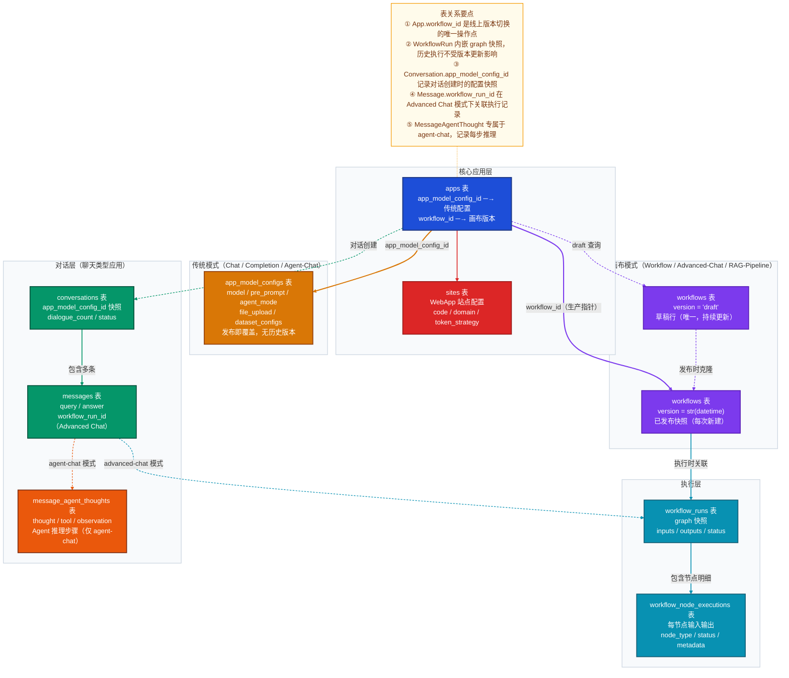
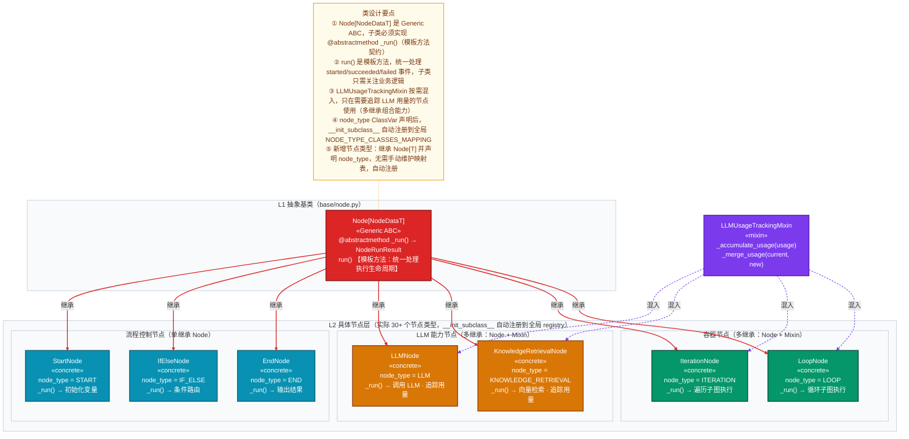

# Mermaid 作图风格指南 · B 代码深潜层

> 适用场景：深入分析模块实现，理解数据持久化结构与代码对象设计。
> 包含图表：③ 数据模型关系图　④ 类层级关系图

---

## 一、两种图的区别与选用

| 维度 | 数据模型关系图 | 类层级关系图 |
|------|-------------|------------|
| **Mermaid 语法** | `flowchart TB` | `flowchart TB` |
| **回答的问题** | 数据如何持久化？表与表如何关联？ | 代码如何组织？抽象层次和设计模式是什么？ |
| **视角** | 静态数据视图 | 静态代码结构视图 |
| **节点代表** | 数据库表（含核心字段） | 类 / 接口 / 抽象基类 |
| **箭头代表** | 外键引用（实线）/ 逻辑关联（虚线） | 继承（实线）/ 实现（虚线）/ 组合 |
| **类比** | 户型图（房间内部陈设与连通） | 建筑构件施工图（材料规格与受力结构） |

```
需要理解"数据怎么存"           → 数据模型关系图
需要理解"代码怎么组织"         → 类层级关系图
```

**与 ER 图的区别**：ER 图强调字段类型和规范化；数据模型关系图强调**业务语义和跨表关系的设计意图**，适合团队沟通而非数据库文档。

**与流程图的区别**：流程图的节点是处理步骤；类层级图的节点是**类/接口**，关注设计意图和扩展机制，而非处理顺序。

---

## 二、数据模型关系图

### 2.1 适用场景

用于回答：这个业务域有哪些数据库表？表与表之间是外键强约束还是逻辑关联？哪些字段是跨表的关键指针？

理解核心业务的数据持久化结构、分析版本快照设计、梳理多租户/多模式数据隔离边界时使用。

### 2.2 完整参考原图

> 展示 Dify 应用管理域：核心应用层 → 传统模式 / 画布模式 → 执行层 → 对话层的完整表关系



---

## 三、类层级关系图

### 3.1 适用场景

用于回答：这个模块 / 子域的代码是如何组织的？哪些是抽象接口，哪些是具体实现？继承和组合关系如何体现设计意图？

**三个视角及其适用目标**：

| 视角 | 核心轴 | 典型适用目标 |
|------|--------|------------|
| **A. 抽象层级视角** | 从 ABC/接口 → 能力类型分支 → 具体实现 | `core/model_runtime/`、`core/workflow/nodes/`、`core/tools/` |
| **B. 聚合建模视角** | 以聚合根为中心 → 实体 → 值对象 | 分析某个子域的领域对象职责（补充数据模型图的业务语义层） |
| **C. 分层依赖视角** | 按 DDD 四层分组 → 类跨层依赖关系 | 验证某个功能模块是否符合 Clean Architecture 约束 |

### 3.2 完整参考原图

> 展示 `core/workflow/nodes/` 工作流节点类型体系（视角 A：抽象层级视角）：Generic ABC 抽象基类层 → 按职责分组的具体节点层，同时展示 Mixin 组合模式。实际共 30+ 个节点类型，图中仅选取 7 个代表性节点，通过分组标注传达完整规模。



---

## 四、最佳实践速查

### 通用规则（两种图共用）

| 设计原则 | 说明 |
|----------|------|
| **`linkStyle` 索引精准计数** | `linkStyle N` 按边的**声明顺序**从 0 开始编号，索引越界会触发渲染崩溃。两条规避守则：① **展开 `&`**：`A & B --> C` 会展开为多条独立边，凡使用 `linkStyle` 的图一律拆成独立行；② **注释标注边总数**：在连接线声明结束后、`linkStyle` 之前插入 `%% 边索引：0-N，共 X 条` 注释强制核对 |
| **连接线语义** | `-->` 实线表示强关联（外键约束引用 / 继承关系）；`-.->` 虚线表示弱关联（逻辑关联无 FK / 接口实现 / Mixin 混入）；连接线标签简明描述关系语义 |
| **subgraph 分组** | 按**业务领域或抽象层次**分组，用 `class SubgraphName layerStyle` 统一背景色；同一 subgraph 内关系密切的节点用 `direction LR` 横排，跨 subgraph 用纵向主流 `TB` |
| **节点换行** | 换行用 `<br>`；首行写主标识（表名或类名），后续行补充核心字段或关键方法签名 |
| **NOTE 注记** | 用 `NOTE -.- 核心节点` 悬浮挂载说明；用 `①②③④⑤` 序号逐条说明设计意图 |

### 数据模型关系图专用

| 设计原则 | 说明 |
|----------|------|
| **节点内容** | 节点首行写**表名**，`<br>` 后列出 2-4 个**核心字段或外键字段**，末行可附加一句关键业务约束说明（如 `"发布即覆盖，无历史版本"`） |
| **subgraph 分组依据** | 按**业务领域**（核心层、执行层、对话层等）分组，而非处理阶段 |
| **箭头颜色含义** | 用 `linkStyle` 为不同业务线的关联边着色：同一业务主线用同一颜色（如工作流相关边统一用紫色 `#7c3aed`，对话相关边用绿色 `#059669`），帮助读者快速跟踪某条业务线的完整关系链 |

### 类层级关系图专用

| 设计原则 | 说明 |
|----------|------|
| **节点内容** | 节点首行写**类名**，第二行写 `«stereotype»`（`«abstract»` / `«concrete»` / `«interface»` / `«mixin»`），第三行列出 1-2 个最能体现设计意图的关键方法签名；不罗列全部字段，只展示设计骨架 |
| **分层分组** | 按**抽象层次**分组：`subgraph L1` 放抽象基类/接口，`subgraph L2` 放能力分支层，`subgraph L3` 放具体实现层；整体呈现"从顶层契约到底层实现"的层次结构 |
| **配色语义** | 抽象基类/ABC 用红色（`#dc2626`）表示"必须被实现的契约"；中间抽象/能力分支用琥珀（`#d97706`）；具体实现类用青蓝（`#0891b2`）；接口/Protocol/Mixin 用紫色（`#7c3aed`） |
| **关系箭头** | 继承用实线 `-->` 加标签 `"继承"`；接口实现用虚线 `-.->` 加标签 `"实现"`；Mixin 混入用虚线加标签 `"混入"`；方向统一从父类指向子类（抽象在上，具体在下） |
