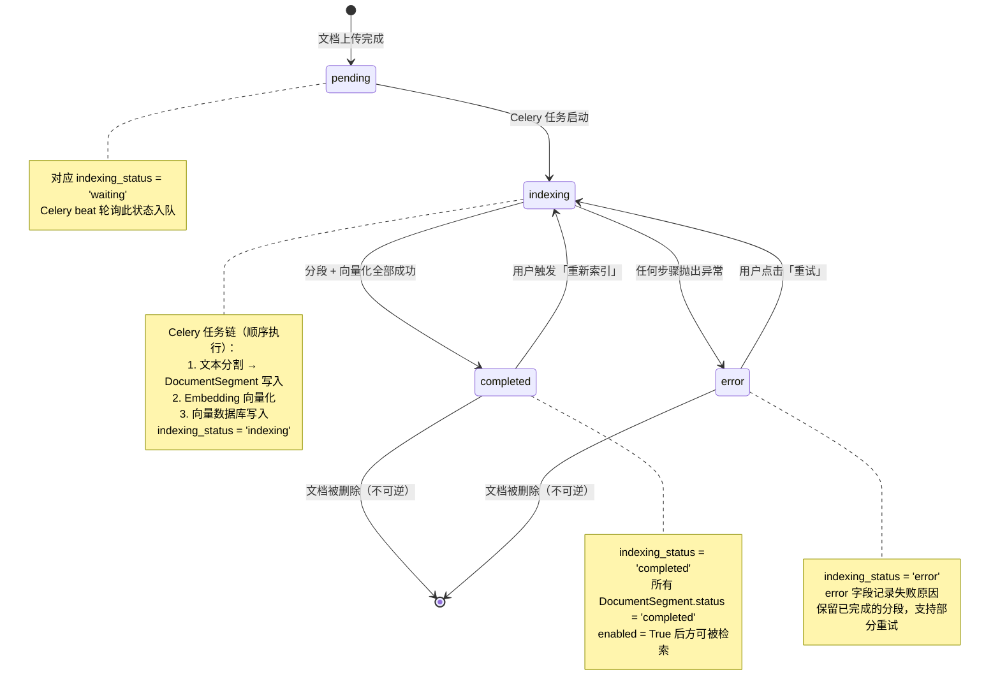
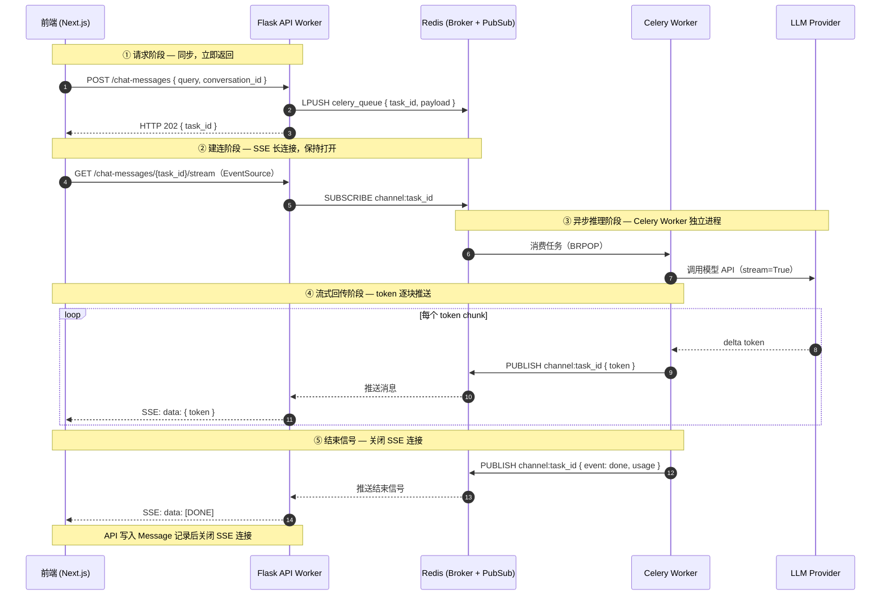

# Mermaid 作图风格指南 · C 运行时行为层

> 适用场景：分析异步链路、跨进程交互、核心实体的生命周期状态转换。
> 包含图表：⑤ 状态机图　⑥ 时序图
>
> ⚠️ 本文件的两种图使用与文件 A/B 完全不同的 Mermaid 语法（`stateDiagram-v2` 和 `sequenceDiagram`），**不支持** `classDef`、`linkStyle`、`subgraph` 等 flowchart 专属语法。

---

## 一、两种图的区别与选用

| 维度 | 状态机图 | 时序图 |
|------|---------|-------|
| **Mermaid 语法** | `stateDiagram-v2` | `sequenceDiagram` |
| **回答的问题** | 对象生命周期内状态如何转换？触发条件是什么？ | 跨组件/进程的消息如何流转？谁在等谁？ |
| **视角** | 单一实体的状态空间 | 多参与者之间的消息时序 |
| **节点代表** | 状态 / 转换事件 | 参与者 / 消息 |
| **箭头代表** | 触发条件与方向（带标签） | 同步调用（实线）/ 异步回调（虚线） |
| **典型触发场景** | 核心实体生命周期、异步任务状态 | Celery 异步链路、SSE 流式响应、WebHook 回调 |

```
需要理解"状态怎么变"           → 状态机图
需要理解"消息怎么传"（异步）   → 时序图
```

**与流程图的核心区别**：流程图描述"处理步骤的顺序"；状态机图描述"对象所处的状态及状态切换的触发条件"；时序图描述"跨进程的等待关系和消息回调"——流程图用端到端视角看单条路径，这两种图用运行时视角看系统真正发生了什么。

---

## 二、状态机图

### 2.1 适用场景

用于回答：核心实体在生命周期内有哪些状态？什么事件触发状态转换？哪些转换是不可逆的？

描述聚合根的状态机，特别适合异步任务状态（Celery 任务链）、工作流执行状态、文档索引状态等"状态驱动"的核心业务逻辑。

### 2.2 完整参考原图

> 展示 Dify 文档索引状态机：从文档上传完成，经 Celery 异步索引，到最终 completed 或 error，以及重试和重新索引路径



### 2.3 作图规范

| 要素 | 规范 |
|------|------|
| **初始 / 终止** | 用 `[*]` 标记初始状态（入口）和终止状态（对象被销毁） |
| **状态命名** | 使用代码中的枚举值原文（如 `pending`、`indexing`），与源码保持严格一致，禁止使用中文状态名或自创别名 |
| **转换标签** | 箭头标签说明触发事件或业务条件，用中文描述语义（如 `"用户点击「重试」"`） |
| **不可逆转换** | 在转换标签后补注 `（不可逆）`，代表状态切换后无法回退 |
| **`note` 辅助块** | 每个关键状态附 `note right of 状态名` 块，说明：① 对应的代码枚举值；② 该状态下的关键技术实现；③ 相关联表字段变化；内容精简在 3 行以内 |
| **并发状态** | 用 `--` 分隔符表示并行复合状态（如节点执行与整体工作流并发） |
| **聚焦单一聚合根** | 一张图只描述一个聚合根；若多个实体状态有联动，在图外用文字说明跨图触发关系，不合并进同一张图 |

---

## 三、时序图

### 3.1 适用场景

用于回答：跨组件/跨进程的消息如何流转？谁主动调用谁？哪些是异步回调？消息的顺序约束是什么？

特别适用于 Celery 任务链、SSE 流式响应、Redis 发布订阅、WebHook 回调等**跨进程异步场景**。这类场景用流程图只能看到一条路径，跨进程的等待关系和消息回调完全不可见。

### 3.2 完整参考原图

> 展示 Dify SSE 对话响应完整异步时序：前端请求 → Flask 任务入队 → Celery 调用 LLM → token 流式回推 → SSE 推送前端



### 3.3 作图规范

| 要素 | 规范 |
|------|------|
| **`autonumber` 必开** | 所有时序图必须在 `sequenceDiagram` 下方第一行写 `autonumber`，步骤编号用于文字描述中精确引用（如"步骤 3 处 API 立即返回 202"） |
| **参与者命名** | 格式 `participant 英文ID as 中文名（技术标识）`，英文 ID 简短，括号内补充技术细节（如 `Redis (Broker + PubSub)`） |
| **同步调用** | 用 `->>` 实线箭头，表示调用方等待返回（同步阻塞） |
| **异步消息 / 回调** | 用 `-->>` 虚线箭头，表示非阻塞推送或回调（调用方不等待） |
| **`Note over` 阶段标注** | 在每个逻辑阶段开始前插入 `Note over 参与者A,参与者B: ① 阶段名 — 关键约束`，用 `①②③` 序号对应 `autonumber` 区间，让读者在跟踪具体消息时始终知道当前所处阶段 |
| **`Note over` 步骤注记** | 关键消息之后用 `Note over 单参与者: 说明` 补充该步骤的性能目标、幂等性保证或设计约束；注记精简在 1 行内 |
| **`loop` 循环块** | 用 `loop 条件描述` 包裹重复消息，标注循环的触发条件（如 `"每个 token chunk"`） |
| **`alt` 分支块** | 用 `alt 条件` / `else 条件` 表示互斥路径（如正常响应 vs 超时 vs 模型报错） |
| **`opt` 可选块** | 用 `opt 条件` 包裹非必须执行的消息段（如 `"仅在开启 tracing 时"`） |
| **聚焦原则** | 一张图聚焦一条完整的异步链路，控制在 5～8 个参与者以内；链路过长时拆为"请求阶段图 + 推理阶段图"分别展示 |
