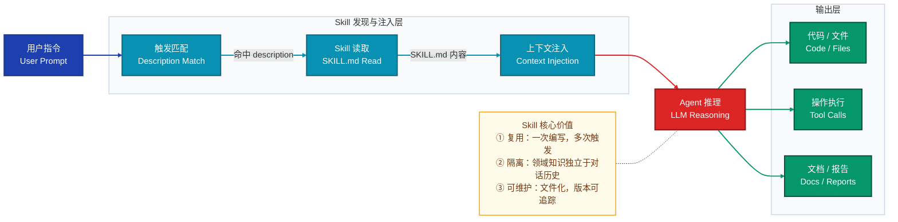
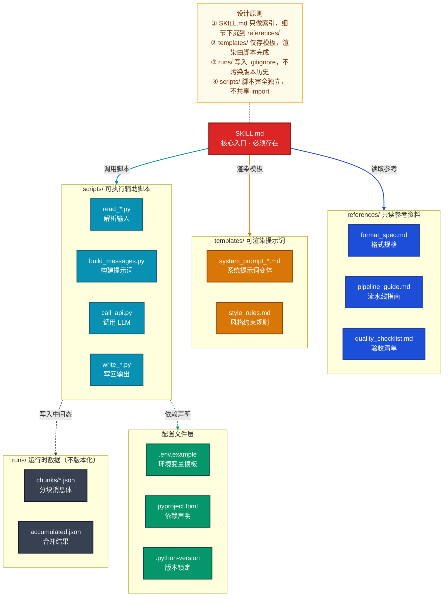
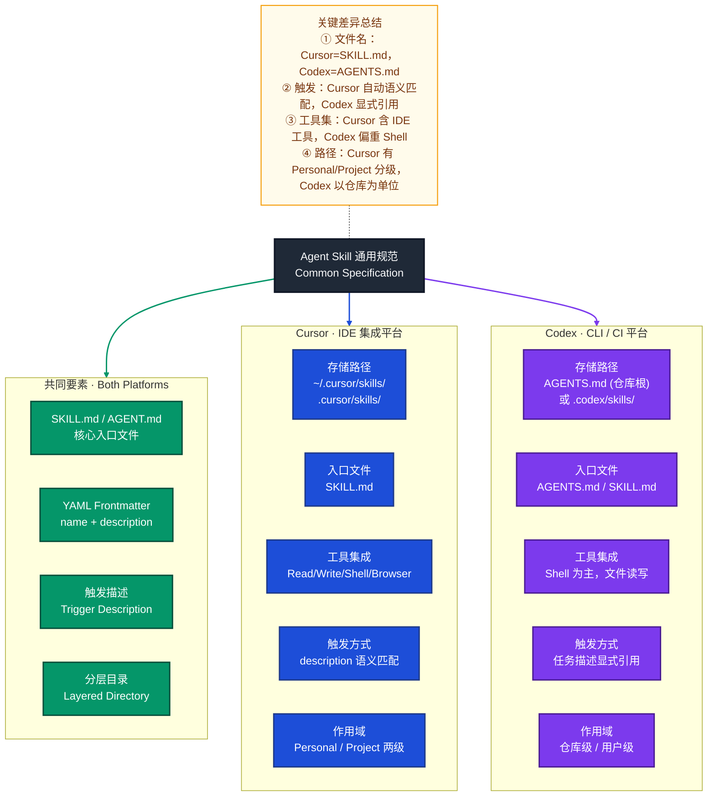
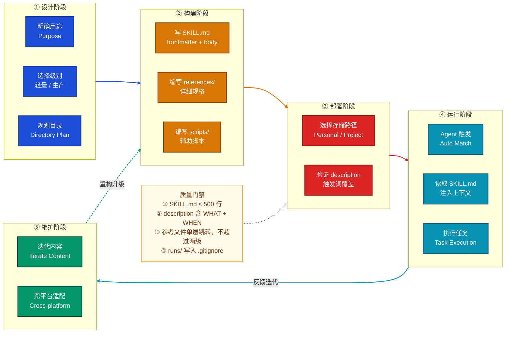

# Skill 目录规范与平台对比

> 说明：本文覆盖 Agent Skill 的标准目录结构，区分**生产级别**与**轻量级**两种形态，
> 给出各文件职责说明与完整示例，并横向对比 Cursor / Codex 两个平台的 Skill 规范差异。

---

## 一、Skill 是什么

Skill 是 Agent 可读取并遵循的**结构化知识单元**。它以 Markdown 文件为载体，封装了：

- 触发时机描述（description / trigger）
- 操作流程指南（workflow / steps）
- 支撑资料（references / templates）
- 可执行辅助脚本（scripts）

Agent 运行时读取 Skill 文件，将其注入上下文，从而获得完成特定任务所需的领域知识与操作规程。



---

## 二、两种级别对比

| 维度 | 生产级别 | 轻量级 |
|------|---------|--------|
| **适用场景** | 多步骤流水线、复杂领域任务、团队共用 | 单一任务、个人工作流、快速实验 |
| **SKILL.md 体量** | 100–500 行，核心骨架 + 索引跳转 | 50 行以内，自包含 |
| **支撑文件** | references/ + templates/ + scripts/ | 无或仅 1 个附加文件 |
| **脚本** | 有，处理文件转换 / 校验 / API 调用 | 无 |
| **维护成本** | 高，需版本管理 | 低，可随时内联修改 |
| **典型示例** | interactive-fiction-writer | git-commit-helper |

---

## 三、目录结构

### 3.1 生产级别（Production-grade）

```
skill-name/
├── SKILL.md                    # 核心入口：frontmatter + 操作流程索引
├── references/                 # 参考资料目录（只读型）
│   ├── format_spec.md          # 格式规格说明
│   ├── pipeline_guide.md       # 流水线分步指南
│   └── quality_checklist.md   # 交付前验证清单
├── templates/                  # 提示词模板目录（可渲染型）
│   ├── system_prompt_variant_a.md
│   ├── system_prompt_variant_b.md
│   └── style_rules.md
├── scripts/                    # 辅助脚本目录（可执行型）
│   ├── read_skeleton.py        # 读取 / 解析输入文件
│   ├── build_messages.py       # 构建 API 消息体
│   ├── call_api.py             # 调用 LLM API
│   └── write_skeleton.py       # 将结果写回输出文件
├── runs/                       # 运行时中间数据（不纳入版本控制）
│   └── {doc_id}/
│       ├── chunks/             # 分块消息 JSON
│       │   ├── chunk_01_messages.json
│       │   └── chunk_02_messages.json
│       ├── context.md          # 当次运行上下文备注
│       └── accumulated.json    # 合并后的生成结果
├── .env.example                # 环境变量模板（不含真实密钥）
├── .python-version             # Python 版本锁定
├── pyproject.toml              # 依赖声明
└── uv.lock                     # 依赖锁文件
```

### 3.2 轻量级（Lightweight）

```
skill-name/
├── SKILL.md                    # 核心入口：自包含，含完整指令与示例
└── examples.md                 # 可选：补充输入/输出示例（仅在示例过多时拆出）
```

> 轻量级 Skill 的 `SKILL.md` 应做到**自包含**：无需跳转外部文件即可完成任务。

---

## 四、各文件职责说明



### 文件职责速查表

| 文件 / 目录 | 级别 | 职责 | 内容类型 |
|------------|------|------|---------|
| `SKILL.md` | 两者必须 | Agent 入口；描述触发时机与操作步骤 | frontmatter + markdown |
| `references/*.md` | 生产级 | 只读参考，Agent 按需跳转 | 详细规格 / 清单 |
| `templates/*.md` | 生产级 | 提示词模板，含占位符，由脚本渲染 | markdown with `{{placeholder}}` |
| `scripts/*.py` | 生产级 | 文件解析 / API 调用 / 结果写回 | Python 脚本 |
| `runs/` | 生产级 | 运行时临时数据，不纳入版本控制 | JSON / markdown |
| `.env.example` | 生产级 | 记录所需环境变量名（不含值） | key=value 样板 |
| `pyproject.toml` | 生产级 | 声明 Python 依赖 | TOML |
| `examples.md` | 轻量级可选 | 补充输入输出示例 | markdown |

---

## 五、完整示例

### 5.1 生产级别示例：interactive-fiction-writer

实际项目结构（来自 `chapters-writing-skills/`）：

```
interactive-fiction-writer/
├── SKILL.md                          ← 触发条件 + 6 步流水线骨架
├── references/
│   ├── format_spec.md                ← xlsx 列定义 + 行分类规则
│   ├── pipeline_guide.md             ← 每步操作的完整指令与示例命令
│   └── quality_checklist.md         ← 交付前 13 项验收标准
├── templates/
│   ├── system_prompt_variant_a.md   ← Pass-1（方向行）系统提示词
│   ├── system_prompt_variant_b.md   ← Pass-2（分支槽）系统提示词
│   └── style_rules.md               ← 文风约束（对白节奏、情绪标签等）
├── scripts/
│   ├── read_skeleton.py             ← xlsx → classified JSON
│   ├── build_messages.py            ← skeleton + context → chunk messages
│   ├── call_api.py                  ← messages JSON → LLM response
│   └── write_skeleton.py            ← results JSON → xlsx
├── .env.example
├── .python-version
├── pyproject.toml
└── uv.lock
```

**SKILL.md frontmatter 示例：**

```yaml
---
name: interactive-fiction-writer
description: >
  Fills in skeleton scripts for interactive fiction / visual novel games,
  producing a fully-written .xlsx file in the exact row-by-row format used
  by the game engine. Use this skill whenever the user provides a skeleton tab
  and wants it expanded into a complete, production-ready script. Triggers on
  phrases like "fill the skeleton", "write the script", "complete the script".
---
```

### 5.2 轻量级示例：git-commit-helper

```
git-commit-helper/
├── SKILL.md       ← 包含格式规则 + 5 条示例，完全自包含
└── examples.md    ← 可选，当示例超过 10 条时拆出
```

**SKILL.md 完整内容（示例）：**

```markdown
---
name: git-commit-helper
description: Generate descriptive git commit messages by analyzing staged diffs.
  Use when the user asks for help writing commit messages, or when running
  git add / git commit workflows.
---

# Git Commit Helper

## 格式规则

\`\`\`
<type>(<scope>): <subject>

[optional body]
\`\`\`

- type: feat / fix / refactor / docs / test / chore
- subject: 动词原形开头，不超过 72 字符，不加句号

## 示例

Input: 新增了用户登录 JWT 鉴权
Output:
\`\`\`
feat(auth): add JWT-based user authentication
\`\`\`
```

---

## 六、不同平台的 Skill 规范对比

### 6.1 Cursor vs Codex 核心差异



### 6.2 对比详情表

| 规范项 | Cursor | Codex |
|--------|--------|-------|
| **入口文件名** | `SKILL.md` | `AGENTS.md`（项目根）或 `SKILL.md` |
| **Frontmatter 字段** | `name`（必须）、`description`（必须） | `name`（建议）、`description`（建议）；无强制 schema |
| **触发机制** | Agent 自动语义匹配 description，无需用户显式提及 | 通常需在任务描述中显式引用 Skill 文件路径，或配置 `AGENTS.md` 为 always-loaded |
| **存储路径** | `~/.cursor/skills/`（个人）<br>`.cursor/skills/`（项目） | 项目根 `AGENTS.md`，或 `~/.codex/skills/`（个人） |
| **作用域** | Personal（跨项目）/ Project（仓库共享）明确二级 | 主要以仓库为粒度，Personal 需手动配置 |
| **工具集** | Read / Write / Shell / Browser / SemanticSearch 等全套 IDE 工具 | 主要为 Shell 命令执行和文件读写，工具集较精简 |
| **scripts/ 目录** | 推荐使用；`uv run` 执行 Python | 推荐使用；直接 `bash` / `python` 执行 |
| **references/ 目录** | 支持 Agent 按需读取跳转 | 支持，但需在 AGENTS.md 中显式 mention 路径 |
| **SKILL.md 行数建议** | ≤ 500 行 | 无硬性限制，建议简洁 |
| **描述字段写法** | 三人称；含 WHAT + WHEN + trigger phrases | 三人称；含 WHAT + WHEN；trigger phrases 重要性稍低 |
| **禁止路径** | `~/.cursor/skills-cursor/`（系统内置，禁止写入） | 无对应限制 |

### 6.3 迁移适配建议

若要将同一个 Skill 跨平台使用：

1. **文件重命名**：Cursor 用 `SKILL.md`，Codex 用 `AGENTS.md`，内容主体复用
2. **Frontmatter 保留**：两者均支持 YAML frontmatter，字段可共用
3. **scripts/ 兼容**：Python 脚本两平台通用；Shell 脚本注意路径分隔符（始终用 `/`）
4. **trigger phrases**：Cursor 中关键，Codex 中可简化
5. **references/ 路径**：两者均支持相对路径引用，保持一致即可

---

## 七、Skill 生命周期全景



---

## 八、最佳实践速查

| 原则 | 说明 |
|------|------|
| **SKILL.md 是骨架，不是百科** | 核心流程放入口，细节下沉到 `references/`；Agent 按需读取，节省上下文 |
| **description 决定触发率** | 写第三人称；包含 WHAT（做什么）和 WHEN（何时触发）；列出关键 trigger phrases |
| **scripts/ 脚本完全独立** | 每个脚本不共享 import，不依赖其他脚本内部模块；Agent 负责调用顺序 |
| **runs/ 不进版本控制** | 运行时中间数据写入 `runs/`，并加入 `.gitignore`；保持仓库整洁 |
| **references/ 单层跳转** | `SKILL.md` 直接链接到 `references/*.md`，不允许二级跳转（`references/sub/deep.md`） |
| **轻量级优先** | 能用轻量级解决的不上生产级；只有真正需要脚本或多文件协作时才升级 |
| **平台差异关注触发机制** | Cursor 依赖语义匹配 description，Codex 更多显式引用；跨平台时优先保证 description 质量 |
