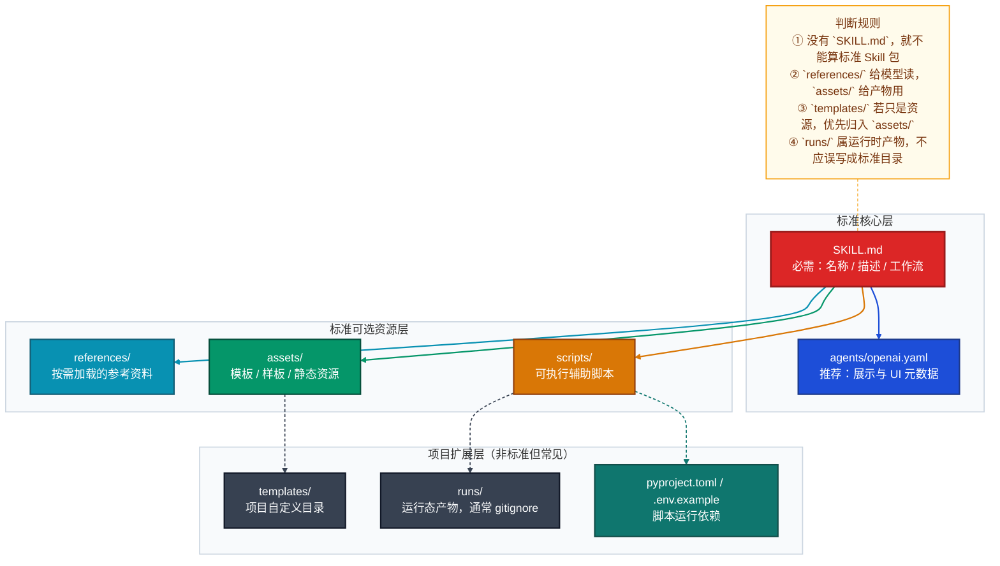
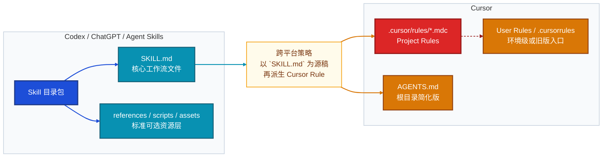

# 标准 Skill 目录规范与平台差异说明

> 目标：说明一个“标准 Skill 包”应该怎样组织，区分轻量级与生产级实现，解释各目录/文件职责，并对比 Codex 与 Cursor 两类平台的规范差异。
> Mermaid 风格参考：`mermaid作图规范/mermaid-A-系统认知层.md`。

---

## 一、先给结论

- 对 **Codex / ChatGPT / Agent Skills** 体系来说，`SKILL.md` 是唯一必须存在的核心文件。
- 一个 **轻量级 Skill**，通常只需要 `SKILL.md`；最多再补一个 `agents/openai.yaml` 做展示元数据。
- 一个 **生产级 Skill**，通常会在 `SKILL.md` 之外，再按需加入 `agents/`、`references/`、`scripts/`、`assets/`。
- `templates/`、`runs/`、`tests/`、`tmp/` 这类目录可以存在，但它们更适合作为**项目扩展目录**，不是 Agent Skills 的通用标准骨架。
- **Cursor** 并不以 `SKILL.md` 目录包为主规范；它的主体系是 **Rules**（`.cursor/rules/*.mdc`）和根目录 `AGENTS.md`。所以 Cursor 与 Codex 的“可复用指令资产”思路相近，但封装规范不同。

---

## 二、标准 Skill 的分层结构



---

## 三、轻量级与生产级的标准目录

### 3.1 轻量级 Skill

适用场景：单一任务、规则清晰、无需脚本、无需复杂资料跳转。

```text
my-skill/
└── SKILL.md
```

如果需要更好的展示名称、简介、入口文案，可再补：

```text
my-skill/
├── SKILL.md
└── agents/
    └── openai.yaml
```

### 3.2 生产级 Skill

适用场景：多步骤流程、团队复用、需要脚本、需要分离参考资料、需要模板或静态资源。

```text
my-skill/
├── SKILL.md
├── agents/
│   └── openai.yaml
├── references/
│   ├── domain-spec.md
│   ├── workflow-guide.md
│   └── quality-checklist.md
├── scripts/
│   ├── prepare_input.py
│   ├── build_messages.py
│   └── export_result.py
├── assets/
│   ├── templates/
│   │   └── output-template.md
│   └── examples/
│       └── sample-output.md
├── pyproject.toml
├── uv.lock
└── .env.example
```

### 3.3 哪些是“标准”，哪些只是“常见”

| 路径 | 是否标准核心 | 说明 |
|------|-------------|------|
| `SKILL.md` | 是 | 唯一硬要求 |
| `agents/openai.yaml` | 否，但推荐 | 展示层元数据，便于 UI / 列表 / 技能卡片 |
| `references/` | 是，标准可选层 | 适合长文档、规范、清单、Schema |
| `scripts/` | 是，标准可选层 | 适合重复、机械、确定性的动作 |
| `assets/` | 是，标准可选层 | 适合模板、样板文件、图片、字体等 |
| `templates/` | 否，项目约定 | 若本质是资源，建议收敛进 `assets/` |
| `runs/` | 否，运行态目录 | 只适合流程产物，不适合作为标准骨架 |
| `pyproject.toml` / `.env.example` | 否，运行依赖 | 只有脚本真的需要运行环境时才加入 |

---

## 四、各目录与文件的职责

| 路径 | 建议级别 | 职责 | 放什么 | 不该放什么 |
|------|----------|------|--------|-----------|
| `SKILL.md` | 必须 | 描述触发边界、输入、步骤、输出、校验 | frontmatter + Markdown 工作流 | 大量冗长背景资料 |
| `agents/openai.yaml` | 推荐 | 给 UI / 平台展示技能名称、说明、默认文案 | 展示元数据 | 业务长文 |
| `references/` | 强烈建议 | 存按需阅读的知识材料 | 规范、清单、Schema、长示例 | 运行时产物 |
| `scripts/` | 按需 | 将可确定流程下沉为脚本 | Python/Bash 等可执行脚本 | 大段纯说明性文档 |
| `assets/` | 按需 | 存最终交付会用到的资源 | 模板、样板、图标、示例文件 | 需要频繁阅读的大说明 |
| `templates/` | 可有可无 | 仅当团队习惯单独分模板目录时使用 | Prompt 模板、输出模板 | 被误当成标准必须目录 |
| `runs/` | 不建议纳入 Skill 标准 | 缓存中间状态与本次运行产物 | JSON、临时 Markdown、日志 | 版本化核心资料 |

补充约束：

- `SKILL.md` 应保留为**骨架与导航层**，不要把所有细节都塞进去。
- 大块说明下沉到 `references/`，模板下沉到 `assets/`，可执行动作下沉到 `scripts/`。
- `README.md`、`CHANGELOG.md`、`INSTALL.md` 这类“给人看的外围文档”，通常不应成为 Skill 包的默认组成。

---

## 五、示例

### 5.1 轻量级示例

目录：

```text
review-summary/
└── SKILL.md
```

`SKILL.md` 示例：

```markdown
---
name: review-summary
description: >
  Use this skill when the user wants a concise summary of code changes,
  review findings, or verification status for a patch or pull request.
---

# Review Summary

1. Inspect the changed files first.
2. Summarize user-visible changes.
3. Summarize technical changes.
4. Mention what was not verified.
```

这个版本的关键点是：**自包含**。模型不需要跳转额外目录，就能完整执行任务。

### 5.2 生产级示例

当前仓库里的 `interactive-fiction-writer` 更接近“生产级 Skill 的项目增强版”：

```text
interactive-fiction-writer/
├── SKILL.md
├── references/
│   ├── format_spec.md
│   ├── pipeline_guide.md
│   ├── quality_checklist.md
│   └── system_prompt_guide.md
├── scripts/
│   ├── read_skeleton.py
│   ├── build_messages.py
│   ├── call_api.py
│   └── write_skeleton.py
├── templates/
│   ├── system_prompt_variant_a.md
│   ├── system_prompt_variant_b.md
│   └── style_rules.md
├── .env.example
├── .python-version
├── pyproject.toml
└── uv.lock
```

它体现了生产级 Skill 的几个典型特征：

- `SKILL.md` 只放骨架和调用规则。
- 细规格放进 `references/`。
- 稳定动作下沉到 `scripts/`。
- 额外用了 `templates/` 作为项目定制目录。
- 依赖与环境文件只为脚本执行服务，不属于 Skill 标准本体。

如果你追求**更强平台可移植性**，可以把这里的 `templates/` 收敛到 `assets/templates/`，这样更接近通用 Agent Skills 骨架。

---

## 六、Codex 与 Cursor 的规范是否一样

**不一样。**

二者都在解决“把可复用工作流沉淀成文件化资产”这个问题，但它们采用的**封装模型**不同：

- **Codex / ChatGPT / Agent Skills**：以一个 Skill 目录包为单位，`SKILL.md` 是核心。
- **Cursor**：以 Rules 为主，核心是 `.cursor/rules/*.mdc`；简单场景下可以用根目录 `AGENTS.md`。



### 6.1 对比表

| 维度 | Codex / ChatGPT / Agent Skills | Cursor |
|------|-------------------------------|--------|
| 核心载体 | `SKILL.md` 所在目录包 | `.cursor/rules/*.mdc` 或 `AGENTS.md` |
| 最小可用形态 | 仅 `SKILL.md` | 一个 `.mdc` 规则文件，或根目录 `AGENTS.md` |
| 元数据方式 | `SKILL.md` frontmatter；`agents/openai.yaml` 可选 | `.mdc` frontmatter（如 `description`、`globs`、`alwaysApply`）；`AGENTS.md` 无元数据 |
| 资源组织 | 支持 `references/`、`scripts/`、`assets/` 等目录化打包 | 以规则文件为中心，可通过 `@filename` 引用其他文件 |
| 自动触发思路 | 基于名称/描述与任务相关性匹配 | 基于 Rule 类型、glob、相关性、手动 `@ruleName` |
| 作用域模型 | Skill 级目录包 | 项目级、子目录级、用户级规则 |
| 跨产品可移植性 | OpenAI 体系内支持导入导出，但产品间不自动同步 | 主要面向 Cursor 自身 |

### 6.2 Cursor 示例

`.cursor/rules/review-summary.mdc`：

```md
---
description: Summarize code changes and missing verification in a concise review style
globs:
  - "**/*"
alwaysApply: false
---

- Inspect changed files before summarizing.
- Separate user-visible changes from technical changes.
- Explicitly mention anything not verified.
```

根目录 `AGENTS.md`：

```md
# Project Instructions

## Review Style

- Summaries must be concise.
- Always mention verification status.
- Prefer concrete file references over vague descriptions.
```

### 6.3 实务判断

- 如果你要做的是 **Codex/ChatGPT Skill**，请以 `SKILL.md` 目录包为主，不要直接照搬 Cursor 的 `.mdc` 结构。
- 如果你要做的是 **Cursor 规则**，请优先写 `.cursor/rules/*.mdc` 或 `AGENTS.md`，不要假设 Cursor 会按 Codex 的 Skill 包目录自动识别。
- 如果你要维护**一份跨平台知识资产**，最佳做法通常是：
  1. 先写一份高质量 `SKILL.md` 作为“工作流源稿”；
  2. 再按平台特性生成 Cursor Rule、AGENTS.md、或平台自己的元数据文件。

---

## 七、推荐落地规范

### 7.1 默认推荐

- 新 Skill 一律先从**轻量级**开始：只写 `SKILL.md`。
- 当出现“长规格、固定脚本、模板资源、多人协作”这四类需求时，再升级到生产级目录。

### 7.2 推荐判断线

- 满足下面任意两条，就建议升级到生产级：
  - `SKILL.md` 已经接近过长，阅读成本明显上升；
  - 同一类说明被频繁复用，适合拆到 `references/`；
  - 有稳定可执行步骤，适合沉到 `scripts/`；
  - 有模板、样板、示例文件，适合沉到 `assets/`。

### 7.3 一句话规范

> 轻量级 Skill 追求“一个文件讲清楚”，生产级 Skill 追求“一个入口调度多个职责明确的目录”；Codex 以 `SKILL.md` 包为核心，Cursor 以 Rules / `AGENTS.md` 为核心，两者相关但不是同一套目录标准。
