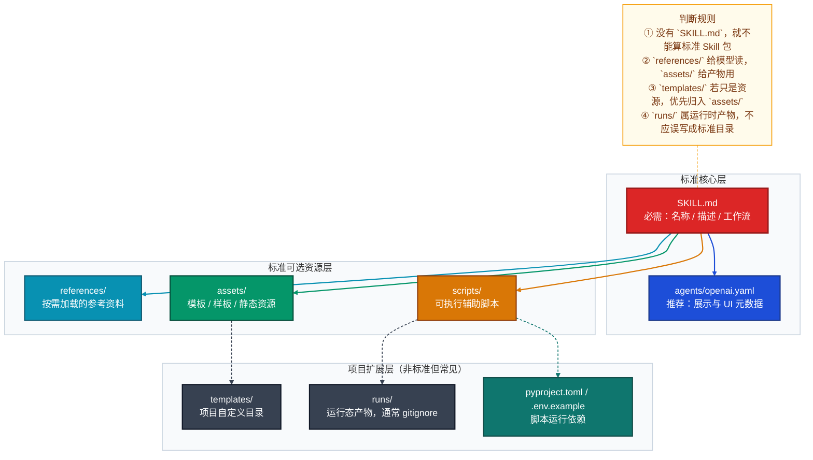
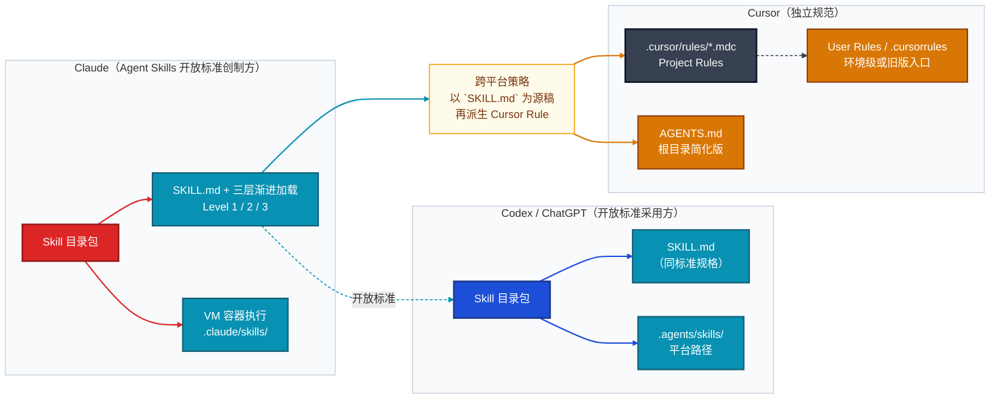
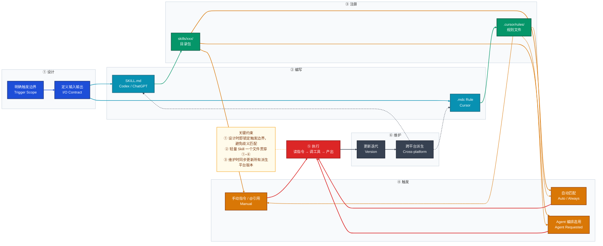

# 标准 Skill 目录规范与平台差异说明

> 适用对象：Claude（claude.ai / Claude Code / API）、Codex / ChatGPT 等遵循 Agent Skills 开放标准的开发者，以及 Cursor Rules 编写者。

---

## 一、核心结论

- `SKILL.md` 是唯一必须存在的文件，没有它就不算标准 Skill 包。
- 新 Skill **一律先从轻量级开始**（只写 `SKILL.md`），满足扩展条件时再升级到生产级。
- **Agent Skills 是 Anthropic（Claude）在 2025 年 12 月发布的开放标准**，Claude Code、Codex CLI、VS Code、Gemini CLI 等 32 个工具均采用相同的 `SKILL.md` 格式，可直接跨平台复用。
- Cursor **不遵循** Agent Skills 标准：它以 `.cursor/rules/*.mdc` 为核心，是独立的规范体系。

---

## 二、目录结构



### 轻量级

适用于：单一任务、规则清晰、无需脚本、无需外部资料。

```text
my-skill/
└── SKILL.md    # 名称/描述/触发/工作流/校验——全在这一个文件
```

如需平台卡片展示（名称、简介、封面文案），补充 `agents/openai.yaml`，不影响执行逻辑。

### 生产级

适用于：多步骤流程、团队协作、需要脚本或分离参考资料。

```text
my-skill/
│
├── SKILL.md                        # 骨架入口，只放触发条件/步骤/输出/校验
├── agents/
│   └── openai.yaml                 # 平台展示元数据（UI 用，不影响执行）
├── references/                     # 给模型按需读取的知识库
│   ├── domain-spec.md              #   业务规格、字段约定
│   ├── workflow-guide.md           #   详细步骤与分支判断
│   └── quality-checklist.md        #   验收清单、质量红线
├── scripts/                        # 可直接运行的确定性脚本
│   ├── prepare_input.py
│   ├── build_messages.py
│   └── export_result.py
├── assets/                         # 产物会直接用到的静态资源
│   ├── templates/
│   │   └── output-template.md
│   └── examples/
│       └── sample-output.md
├── pyproject.toml                  # 脚本依赖（仅 scripts/ 需要运行时才加）
├── uv.lock                         # 版本锁定，不要手改
└── .env.example                    # 环境变量模板（真实 .env 必须加入 .gitignore）
```

---

## 三、各目录职责

| 路径 | 建议级别 | 放什么 | 不该放什么 |
|------|----------|--------|-----------|
| `SKILL.md` | **必须** | frontmatter + 工作流骨架（触发/输入/步骤/输出/校验） | 大量冗长背景资料 |
| `agents/openai.yaml` | 推荐 | 展示层元数据（名称/简介/封面文案） | 业务逻辑 |
| `references/` | 按需（推荐） | 规范、清单、Schema、长示例——**给模型读** | 运行时产物 |
| `scripts/` | 按需 | 可直接运行的 Python/Bash 脚本（确定性动作） | 说明性文档 |
| `assets/` | 按需 | 模板、样板、示例文件——**产物会直接用到** | 需要模型频繁阅读的规范 |
| `templates/` | 不推荐独立存在 | 收敛进 `assets/templates/` | — |
| `runs/` | 不纳入版本控制 | 运行时中间产物、日志 | 版本化核心资料 |
| `pyproject.toml` / `.env.example` | 仅脚本需要时 | 依赖声明与环境变量模板 | — |

> `references/` 与 `assets/` 的核心区别：前者是**给模型读取**的知识库，后者是**产物会直接使用**的资源，不要混用。

---

## 四、SKILL.md 写法

frontmatter 至少包含 `name` 和 `description`；正文建议固定为**输入 / 步骤 / 输出 / 校验**四段结构。如需精确控制触发场景，在 frontmatter 中补充 `triggers`。

```markdown
---
name: review-summary
description: >
  Use this skill when the user wants a concise summary of code changes,
  review findings, or verification status for a patch or pull request.
triggers:
  - "summarize PR"
  - "review this diff"
  - "what changed in this commit"
---

# Review Summary

## 输入
- `target`：PR 编号、commit hash 或文件路径（必填）

## 步骤
1. 检查目标范围内的变更文件。
2. 按"用户可见变更"与"技术变更"分开汇总。
3. 明确标注未验证的部分。

## 输出
- 不超过 5 条的要点列表；最后一条固定为未验证项说明。

## 校验
- `target` 为空 → 立即终止，提示用户补充。
- 未找到变更文件 → 输出"无可审查内容"并终止。
```

---

## 五、生产级完整示例

以"内容审核 Skill"（`content-review`）为例：

```text
content-review/
│
├── SKILL.md                        # 骨架：触发/步骤/输出/终止条件
├── agents/
│   └── openai.yaml
├── references/
│   ├── review-criteria.md          # 评分标准与分类规则
│   ├── edge-cases.md               # 争议情况与裁判参考
│   └── output-schema.md            # 输出字段定义（JSON Schema）
├── scripts/
│   ├── batch_review.py             # 批量读取内容、调用 API、写回结果
│   └── export_report.py            # 汇总报告生成
├── assets/
│   ├── templates/
│   │   └── review-report.md        # 审核报告输出模板
│   └── examples/
│       └── sample-review.md        # 示例审核结果（可作 few-shot 参考）
├── pyproject.toml
├── uv.lock
└── .env.example
```

---

## 六、三平台对比：Claude / Codex / Cursor



### 对比表

| 维度 | Claude | Codex / ChatGPT | Cursor |
|------|--------|-----------------|--------|
| 核心载体 | `SKILL.md` 目录包（**开放标准创制方**） | `SKILL.md` 目录包（开放标准采用方） | `.cursor/rules/*.mdc` 或 `AGENTS.md` |
| 最小可用形态 | 仅 `SKILL.md` | 仅 `SKILL.md` | 一个 `.mdc` 规则文件，或根目录 `AGENTS.md` |
| 元数据方式 | `SKILL.md` frontmatter（`name` max 64 字符，`description` max 1024 字符） | `SKILL.md` frontmatter（规格相同） | `.mdc` frontmatter（`description`、`globs`、`alwaysApply`）；`AGENTS.md` 无元数据 |
| 资源组织 / 加载方式 | 三层渐进加载：启动只加载 ~100 token 元数据；触发后读 SKILL.md；按需加载 scripts/references/assets | 同 Agent Skills 标准目录结构 | 以规则文件为中心，通过 `@filename` 引用其他文件 |
| 触发机制 | 启动时按 `description` 预加载元数据；相关任务触发时自动读取完整 SKILL.md 及资源文件 | 平台按 `name`+`description` 语义匹配自动推荐；支持显式调用与 Agent 编排选用 | **Always**（全局注入）/ **Auto Attached**（glob 匹配）/ **Agent Requested**（AI 按需选用）/ **Manual**（`@ruleName`） |
| 执行环境 | VM 容器内执行；内置 bash / Python 代码能力；官方预置 PPTX / Excel / Word / PDF 技能 | 由平台开放（如 `code_interpreter`、`browsing`）；`SKILL.md` 本身不声明工具集 | `.mdc` frontmatter 可通过 `tools` 字段约束；Cursor 默认提供文件读写、终端、代码搜索 |
| 安装路径 | Claude Code：`.claude/skills/`（项目）/ `~/.claude/skills/`（个人）；API：通过 `/v1/skills` 上传 | Codex CLI：`.agents/skills/`；ChatGPT 路径由平台管理 | `.cursor/rules/`（不识别 Skill 目录结构） |
| 共享作用域 | claude.ai：用户级；Claude API：工作区共享；Claude Code：项目或个人级 | OpenAI 体系内支持导入导出，产品间不自动同步 | 主要面向 Cursor 自身 |
| 受限路径 | API：无网络访问、无运行时包安装；claude.ai：网络访问视用户设置；Claude Code：与主机网络一致 | `SKILL.md` 内不可引用本地路径；外部资源须通过 Skill 加载机制读取 | `alwaysApply: false` 的规则不在非触发场景注入；`.cursor/rules/` 外的 `.mdc` 不被识别 |
| 跨平台互通性 | **与 Codex、VS Code、Gemini CLI 等 32 个工具直接互通**（相同 `SKILL.md` 格式） | 与 Claude Code 相同格式互通 | 主要面向 Cursor 自身 |

### Cursor 示例

`.cursor/rules/review-summary.mdc`：

```md
---
description: Summarize code changes and missing verification in a concise review style
globs:
  - "**/*"
alwaysApply: false
---

- Inspect changed files before summarizing.
- Separate user-visible changes from technical changes.
- Explicitly mention anything not verified.
```

根目录 `AGENTS.md`：

```md
# Project Instructions

## Review Style

- Summaries must be concise.
- Always mention verification status.
- Prefer concrete file references over vague descriptions.
```

### 实务判断

- 做 **Claude Skill** → Claude Code 中放 `.claude/skills/` 目录；API 调用时通过 `/v1/skills` 上传；充分利用 VM 执行环境和三层渐进加载做复杂 Skill。
- 做 **Codex / ChatGPT Skill** → 同样以 `SKILL.md` 目录包为主，路径放 `.agents/skills/`；与 Claude 格式完全兼容，可直接复用。
- 做 **Cursor 规则** → 优先写 `.cursor/rules/*.mdc` 或 `AGENTS.md`，Cursor 不会自动识别 Agent Skills 目录结构。
- 维护**跨平台知识资产** → Agent Skills 开放标准保证同一份 `SKILL.md` 可在 Claude / Codex / VS Code 等 32 个工具直接使用；若需支持 Cursor，再专门派生 `.mdc` 文件。

---

## 七、落地判断

新 Skill 一律先从轻量级开始，满足以下**任意两条**时升级到生产级：

- `SKILL.md` 已过长，阅读成本明显上升
- 有长规格/清单/Schema 适合拆到 `references/`
- 有稳定可执行步骤适合沉到 `scripts/`
- 有模板/样板/示例文件适合沉到 `assets/`

> 轻量级 Skill 追求"一个文件讲清楚"，生产级 Skill 追求"一个入口调度多个职责明确的目录"；Codex 以 `SKILL.md` 包为核心，Cursor 以 Rules / `AGENTS.md` 为核心，两者相关但不是同一套目录标准。

---

## 附录：Skill 生命周期全景图

> 适用于向他人说明"一个 Skill 从设计到上线维护"完整路径。


